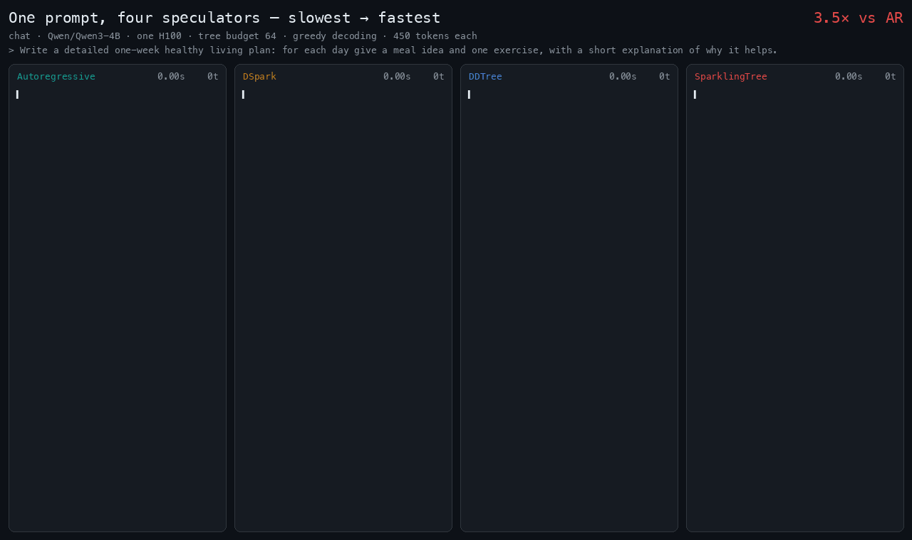
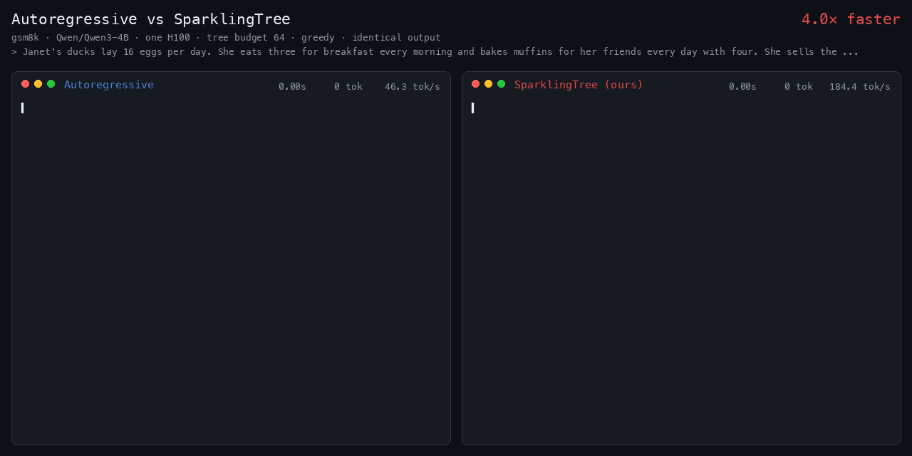
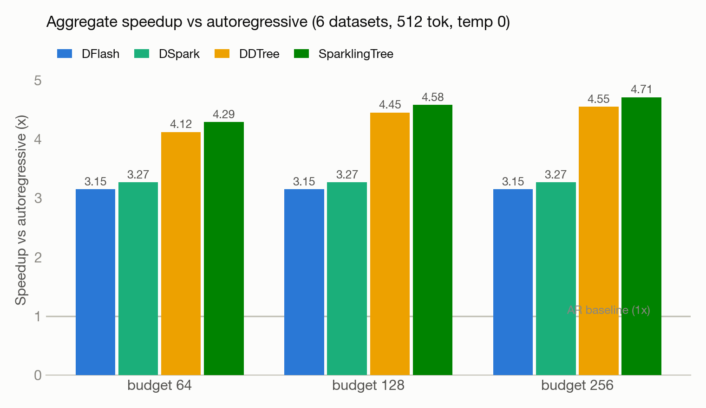
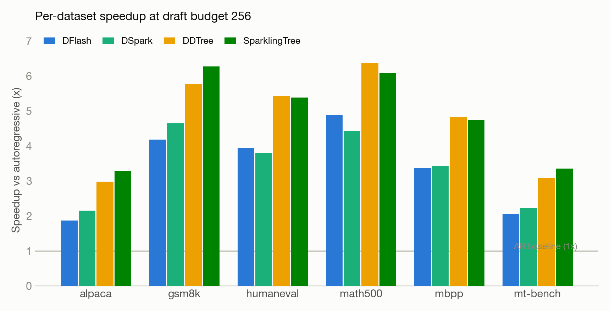

# SparklingTree

Frontier speculative decoding. Read more here: https://jwlabs.vercel.app/post/sparklingtree

## Demo

Four decoders racing on the same prompt (real H100 timestamps, identical output):

Head-to-head: autoregressive vs SparklingTree (gsm8k)

## Results

Citable run: seed 1, 6 datasets × 12 prompts, 512 tokens, temp 0, sync ON, compaction ON, C=128, fanout 64, single H100.

### Aggregate speedup vs autoregressive

| Draft budget | DFlash | DSpark | DDTree | SparklingTree |
|---|---|---|---|---|
| 64 | 3.15× | 3.27× | 4.12× | **4.29×** |
| 128 | 3.15× | 3.27× | 4.45× | **4.58×** |
| 256 | 3.15× | 3.27× | 4.55× | **4.71×** |

DFlash and DSpark are chain drafters, so they don't use the tree budget — their numbers are constant across budgets.

### Full per-dataset numbers

Each cell is `accepted tokens/step · tokens/sec`; bold marks the fastest method per row. Autoregressive is the 1.00-accept baseline (~52 tok/s on every dataset).

<b>Budget 256</b>

| Dataset | AR tok/s | DFlash | DSpark | DDTree | SparklingTree |
|---|---|---|---|---|---|
| alpaca | 51.0 | 3.07 · 95.4 | 3.66 · 109.9 | 4.95 · 152.1 | **5.53 · 168.1** |
| gsm8k | 52.2 | 6.71 · 218.0 | 7.88 · 242.6 | 9.53 · 300.8 | **10.72 · 327.5** |
| humaneval | 52.7 | 6.32 · 207.5 | 6.41 · 200.2 | **9.31 · 286.2** | 9.52 · 283.7 |
| math500 | 52.0 | 7.80 · 253.6 | 7.37 · 230.5 | **10.39 · 331.3** | 10.22 · 316.6 |
| mbpp | 52.4 | 5.47 · 176.6 | 5.77 · 179.8 | **8.21 · 252.5** | 8.38 · 248.8 |
| mt-bench | 51.5 | 3.31 · 105.8 | 3.76 · 114.7 | 5.24 · 158.8 | **5.87 · 172.9** |
| **Aggregate** | 52.0 | 5.10 · 163.9 | 5.53 · 170.3 | 7.67 · 237.1 | **8.15 · 245.0** |

<b>Budget 128</b>

| Dataset | AR tok/s | DFlash | DSpark | DDTree | SparklingTree |
|---|---|---|---|---|---|
| alpaca | 51.0 | 3.07 · 95.4 | 3.66 · 109.9 | 4.61 · 147.8 | **5.40 · 169.0** |
| gsm8k | 52.2 | 6.71 · 218.0 | 7.88 · 242.6 | 8.99 · 280.9 | **10.30 · 311.9** |
| humaneval | 52.7 | 6.32 · 207.5 | 6.41 · 200.2 | **8.97 · 284.7** | 9.13 · 279.8 |
| math500 | 52.0 | 7.80 · 253.6 | 7.37 · 230.5 | **10.14 · 323.9** | 9.71 · 302.0 |
| mbpp | 52.4 | 5.47 · 176.6 | 5.77 · 179.8 | **7.80 · 252.9** | 7.88 · 244.7 |
| mt-bench | 51.5 | 3.31 · 105.8 | 3.76 · 114.7 | 5.02 · 158.0 | **5.44 · 167.1** |
| **Aggregate** | 52.0 | 5.10 · 163.9 | 5.53 · 170.3 | 7.28 · 231.5 | **7.73 · 238.3** |

<b>Budget 64</b>

| Dataset | AR tok/s | DFlash | DSpark | DDTree | SparklingTree |
|---|---|---|---|---|---|
| alpaca | 51.0 | 3.07 · 95.4 | 3.66 · 109.9 | 4.46 · 132.7 | **5.10 · 149.3** |
| gsm8k | 52.2 | 6.71 · 218.0 | 7.88 · 242.6 | 8.65 · 268.7 | **9.73 · 298.6** |
| humaneval | 52.7 | 6.32 · 207.5 | 6.41 · 200.2 | 8.19 · 267.7 | **8.78 · 273.1** |
| math500 | 52.0 | 7.80 · 253.6 | 7.37 · 230.5 | **9.70 · 309.7** | 9.25 · 287.2 |
| mbpp | 52.4 | 5.47 · 176.6 | 5.77 · 179.8 | **7.60 · 231.6** | 7.53 · 224.5 |
| mt-bench | 51.5 | 3.31 · 105.8 | 3.76 · 114.7 | 4.64 · 145.3 | **5.15 · 157.0** |
| **Aggregate** | 52.0 | 5.10 · 163.9 | 5.53 · 170.3 | 6.86 · 214.4 | **7.34 · 223.4** |

Figures are generated by `assets/make_results_fig.py` from these numbers.

## Folders

- `harness/` — shared decode core (DDTree, DFlash, DSpark, SparklingTree) + the benchmark runner
- `demo/` — streaming/race demo GIFs and the script that renders them
- `experiment1-harness/` — first end-to-end harness benchmark
- `experiment2-block16/` — fine-tuning DSpark to draft 16 tokens/block + training recipe
- `experiment3-timings/` — per-phase wall-clock timing instrumentation
- `experiment4-faster/` — faster tree builder (the precompute best-first builder)
- `experiment5-final-results/` — head-to-head: DFlash vs DSpark vs DDTree vs SparklingTree
- `archive-1-speedup-w-confidence-head-verification/` — earlier confidence-head verification attempt
- `archive-2-finding_best-beam/` — earlier beam-search tuning
- `old-experiments/` — scratch / superseded runs
- `reference-papers/` — DDTree, DFlash, DSpark PDFs
- `assets/` — figures and images
